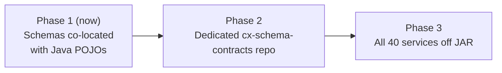

# CX Object Model — Schema Contract Repository

Language-neutral JSON Schema contracts for the ExpertFlow CIM (Customer Interaction Management) object model. These schemas decouple the 40+ microservices from the compiled Java `objectmodel` JAR.

## Repository layout

```
schemas/
├── README.md          ← this file (governance & consumer guide)
└── v1/                ← SemVer major version 1 contracts
    ├── cim-message.json       # Root: message envelope
    ├── customer.json          # Root: customer profile
    ├── task.json              # Root: routing task
    ├── message-header.json
    ├── message-body.json      # Polymorphic oneOf (25 subtypes)
    ├── enums/                 # Shared enum schemas (DRY)
    └── …                      # ~95 referenced child schemas
```

### Layout rules

| Rule | Detail |
|------|--------|
| **SemVer folders** | Breaking changes go in a new major folder (`v2/`, `v3/`). Never mutate published schemas in place except documented bugfixes. |
| **Filenames** | kebab-case, matching the `$id` path segment (e.g. `cim-message.json`). |
| **`$id` URLs** | Every schema declares `"$id": "https://github.com/expertflow/object-model/schemas/v1/<path>"` matching its file location exactly. |
| **`$ref` deduplication** | Shared types (`customer.json`, `channel-data.json`, etc.) are referenced, never duplicated inline. Use relative paths within the same version folder. |
| **Draft version** | All schemas use `"$schema": "https://json-schema.org/draft/2020-12/schema"`. |

## For microservice teams (consumers)

All 40 microservice teams have **read access** to this repository.

### What you should do

1. **Pin a version** — Reference schemas by Git tag, commit SHA, or raw `$id` URL. Do not copy schema files into your service repo.
2. **Generate bindings** — Use your language toolchain to generate types/validators from the schema URLs:
   - TypeScript: `quicktype`, `json-schema-to-typescript`
   - Python: `datamodel-code-generator`
   - Java: `jsonschema2pojo`, OpenAPI generator
   - Go: `go-jsonschema`
3. **Validate at boundaries** — Validate inbound/outbound payloads against the pinned schema version at API and message-bus boundaries.

### What you must not do

- Do **not** modify schema files directly in your service.
- Do **not** fork schemas into private repos (they will drift).
- Do **not** depend on the Java JAR for validation once your service has migrated to schema-based contracts.

## For contributors (contract changes)

All contract updates **must go through a Pull Request**. Direct pushes to `main` are not permitted for schema changes.

### PR checklist

1. Schema diff with clear description of what changed and why.
2. **Impact assessment** — List affected microservices and whether the change is backward-compatible.
3. **SemVer decision**:
   - **Patch** (same `v1/` folder): new optional fields, documentation fixes, constraint relaxations.
   - **Major** (new `v2/` folder): removed/renamed fields, type changes, new required fields.
4. Run local validation: `python3 scripts/validate_schemas.py` (requires `jsonschema` — see below).
5. For breaking changes: require review from object-model maintainers **and** at least one consuming team.

### Regenerating schemas from Java POJOs

During the migration phase, schemas are maintained alongside Java sources in this repo:

```bash
python3 scripts/generate_schemas.py    # regenerate from blueprint script
python3 scripts/validate_schemas.py    # syntax, $ref, and sample payload checks
```

## Automated safety validation (CI blueprint)

Wire these checks into your CI pipeline on every schema PR:

| Check | Tool | Purpose |
|-------|------|---------|
| Schema syntax | `python3 scripts/validate_schemas.py` | Draft 2020-12 meta-validation |
| `$ref` resolution | `scripts/validate_schemas.py` (built-in) | No broken relative links |
| Backward compatibility | Custom diff tool (Phase 2) | Ensure patch releases only add optional fields |
| Golden fixtures | Sample JSON per root type | Regression against real payloads |

### Local setup for validation

```bash
python3 -m venv .schema-venv
.schema-venv/bin/pip install jsonschema referencing
python3 scripts/validate_schemas.py
```

## Entry-point schemas

| Schema | `$id` suffix | Java source |
|--------|-------------|-------------|
| `cim-message.json` | `/schemas/v1/cim-message.json` | `CimMessage.java` |
| `customer.json` | `/schemas/v1/customer.json` | `Customer.java` |
| `task.json` | `/schemas/v1/task.json` | `task/Task.java` |

## Migration path



- **Phase 1**: Consume `/schemas/v1/` from this repo; Java JAR remains the runtime source for services not yet migrated.
- **Phase 2**: Promote `/schemas/` to a dedicated `cx-schema-contracts` repository. Keep `$id` URLs stable via GitHub raw URL redirects or a schema CDN (Artifactory/Nexus/Pages).
- **Phase 3**: Deprecate the shared validation JAR; all services validate against schema contracts only.

## Related

- Java POJO source: `src/main/java/com/ef/cim/objectmodel/`
- Maven artifact: `io.github.expertflow:objectmodel` (legacy, being decoupled)
